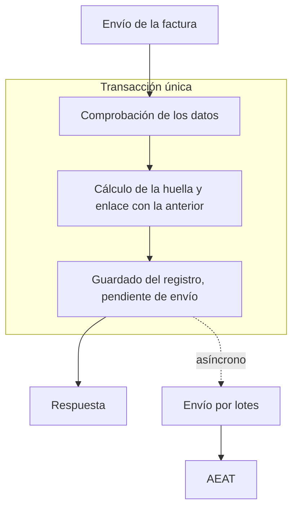
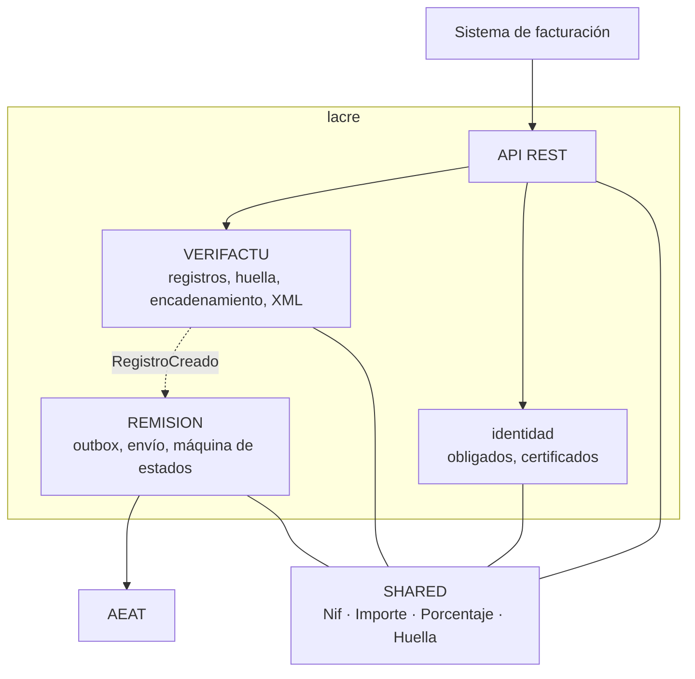

# lacre

<p align="center"></p>

<p align="center"><a href="https://github.com/manuel-umu/lacre/actions/workflows/ci.yml"></a></p>

Componente de facturación Veri\*Factu. Genera los registros de facturación que exige el Real
Decreto 1007/2023 y la Orden HAC/1177/2024, los encadena con su huella y los remite a la AEAT.

Se despliega como una API REST autoalojada. Cada expedición o anulación de una factura se
notifica a la API, que responde con el identificador, la posición en la cadena y la huella del
registro. La remisión a la AEAT se realiza de forma asíncrona, en lotes y con reintentos.

Es un proyecto personal y de código abierto, bajo licencia Apache 2.0. Los detalles de diseño
están en la [documentación técnica](docs/documentacion.md).

## Alcance

Solo opera en modalidad Veri\*Factu. Queda fuera el registro de eventos y la firma XAdES, que la ley exige únicamente en la modalidad no Veri\*Factu.

> **Aviso.** lacre no está certificado ni cuenta con declaración responsable. El RD 1007/2023
> exige esa declaración a quien produce o comercializa un sistema informático de facturación, y
> quien use lacre en producción asume esa obligación. Este repositorio no es asesoramiento fiscal
> ni legal.

## Cómo funciona



La respuesta no llega hasta que el registro está guardado. Si algo falla, se deshace la
transacción entera y la respuesta es un error, porque la norma no admite facturas sin su registro.
Sí puede existir un registro sin remitir: la norma exige el registro, no que la AEAT esté
disponible, y por eso el envío es asíncrono y reintentable.

## Arquitectura

Monolito modular con Spring Modulith, hexagonal por módulo. Cuatro módulos más un paquete de
tipos compartidos.



El estado del proyecto, la huella, la persistencia, la remisión, la API, los tests y la estructura
del repositorio se detallan en la [documentación técnica](docs/documentacion.md).

## Stack

Java 25, Spring Boot 4.1, Spring Modulith 2.1, Spring Data JDBC, PostgreSQL 17 con Flyway. Thymeleaf y htmx para la consola de operación, todavía pendiente.

Tests con JUnit 5, AssertJ, Testcontainers con PostgreSQL real, jqwik, XMLUnit, WireMock y ArchUnit.


## Cómo ejecutarlo

Solo hace falta Docker. La base de datos y la aplicación se levantan con `docker compose`.

**1. Configurar las claves.** Se copia el fichero de ejemplo:

```bash
cp .env.example .env
```

Y en `.env` se sustituyen las tres claves de ejemplo por claves propias, que pueden generarse con
`openssl rand -base64 32`. La URL del QR puede quedarse como está:

| Variable | Para qué sirve |
|---|---|
| `LACRE_DB_CLAVE` | Clave del propietario de la base de datos, que aplica las migraciones |
| `LACRE_DB_CLAVE_APLICACION` | Clave del rol con el que se conecta la aplicación |
| `LACRE_API_CLAVE` | Clave que deben enviar las llamadas a la API; mínimo 32 caracteres |
| `LACRE_QR_URL_BASE` | Destino de los códigos QR; el valor de ejemplo es el entorno de pruebas de la AEAT |

**2. Arrancar.**

```bash
docker compose up -d db lacre
```

La primera vez se construye la imagen y tarda unos minutos. La API queda en
<http://localhost:8080>.

**3. Dar de alta un obligado tributario**, que es quien expide las facturas. Todas las llamadas
llevan la clave de la API en la cabecera `Authorization`:

```bash
curl -X PUT http://localhost:8080/v1/obligados/89890001K \
  -H "Authorization: Bearer <LACRE_API_CLAVE>" \
  -H "Content-Type: application/json" \
  -d '{ "nombreRazon": "Obligado de prueba SL", "zonaHoraria": "Europe/Madrid" }'
```

**4. Registrar una factura.** La cabecera `Idempotency-Key` es un identificador único por
petición, que evita registrar dos veces la misma factura si se reintenta:

```bash
curl -X POST http://localhost:8080/v1/registros/alta \
  -H "Authorization: Bearer <LACRE_API_CLAVE>" \
  -H "Idempotency-Key: factura-FA-1" \
  -H "Content-Type: application/json" \
  -d '{
    "idFactura": {
      "idEmisorFactura": "89890001K",
      "numSerieFactura": "FA/1",
      "fechaExpedicionFactura": "2026-01-15"
    },
    "nombreRazonEmisor": "Obligado de prueba SL",
    "tipoFactura": "F1",
    "descripcionOperacion": "Servicios de consultoría",
    "destinatarios": [ { "nombreRazon": "Cliente SL", "nif": "A28015865" } ],
    "desglose": [ {
      "impuesto": "01",
      "claveRegimen": "01",
      "calificacion": "S1",
      "tipoImpositivo": 10,
      "baseImponibleOimporteNoSujeto": 111.10,
      "cuotaRepercutida": 12.35
    } ],
    "cuotaTotal": 12.35,
    "importeTotal": 123.45
  }'
```

La respuesta `201` incluye el identificador del registro, su posición en la cadena, su huella y
la URL del código QR.

**5. Consultar la cadena del obligado**, que recalcula y comprueba todas sus huellas:

```bash
curl http://localhost:8080/v1/obligados/89890001K/cadena \
  -H "Authorization: Bearer <LACRE_API_CLAVE>"
```

**6. Parar.**

```bash
docker compose down
```

Para enviar los registros a la AEAT hace falta además el certificado de cada obligado; se explica
en [Despliegue](#despliegue).

### Tests

Requieren JDK 25 y Docker en marcha, porque levantan un PostgreSQL con Testcontainers:

```bash
./mvnw test
```

## Integración

El contrato está en [src/main/resources/static/openapi.yaml](src/main/resources/static/openapi.yaml),
en OpenAPI 3.1, y la aplicación lo sirve en `/openapi.yaml` sin necesidad de credencial. Incluye
la guía de la primera factura, los ejemplos de cada operación y los códigos de error.

Para leerlo con Swagger UI:

```bash
docker compose up -d docs
```

Queda en <http://localhost:8081>.

## Licencia

[Apache 2.0](LICENSE).
