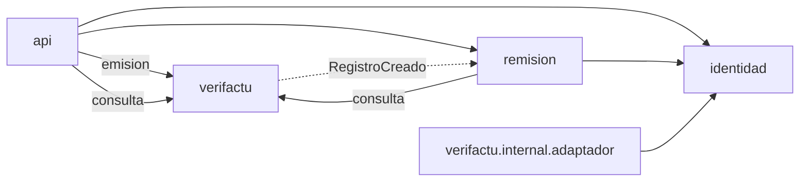
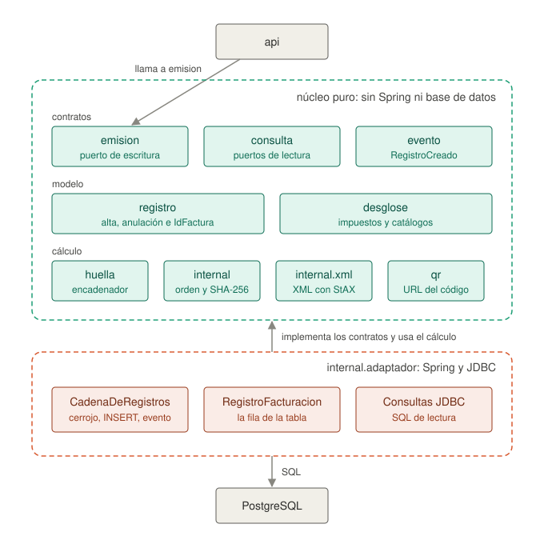
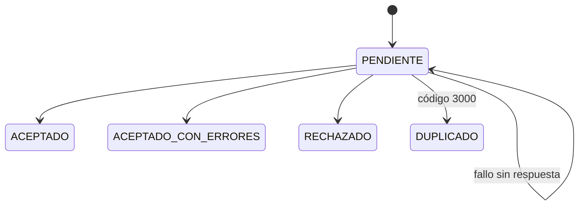

# Documentación técnica de lacre

Explicación de la organización del código y decisiones de diseño.

## Módulos

El proyecto es un monolito modular hecho con Spring Modulith. Cada módulo es un paquete dentro de `dev.lacre`. Lo que está en el paquete raíz del módulo (y en los subpaquetes marcados con `@NamedInterface`) es su API pública, y lo que está en `internal/` solo lo puede usar el propio módulo.

| Módulo | Responsabilidad |
|---|---|
| `shared` | Value objects: `Nif`, `IdOtro`, `Importe`, `Porcentaje`, `Huella` |
| `verifactu` | Modelo del registro, huella, encadenamiento, XML y persistencia de la cadena |
| `identidad` | Obligados tributarios, con su zona horaria, y sus certificados |
| `remision` | Outbox, máquina de estados del envío, cliente SOAP y despachador |
| `api` | La API REST: emisión, consulta, alta de obligados, autenticación y errores |



**`verifactu` no conoce a ningún otro módulo.** Cuando crea un registro publica el evento `RegistroCreado`, el cual es escuchado por `remision`, dentro de la misma transacción.

## Hexagonal por módulo

Cada módulo es su propio hexágono; no hay capas globales que atraviesen los módulos. Dentro de `internal/`, el subpaquete `adaptador/` es el único sitio donde aparece Spring.

En `verifactu` esa frontera separa un núcleo **puro**, que no depende de Spring ni de base de datos, de la capa que lo despliega:



La idea de esta separación es que el núcleo se pueda probar sin levantar nada.

## La huella

La AEAT fija el orden exacto en que se concatenan los campos del registro:

```
IDEmisorFactura=89890001K&NumSerieFactura=12345678/G33&FechaExpedicionFactura=01-01-2024
&TipoFactura=F1&CuotaTotal=12.35&ImporteTotal=123.45&Huella=&FechaHoraHusoGenRegistro=...
```

La cadena se codifica en UTF-8 y se le aplica SHA-256.

Todo lo que depende de la especificación de la AEAT está en una sola clase, `CanonicalizadorAeat`, detrás de la interfaz `Canonicalizador`. Esa implementación recibe `CamposDeHuella`, un tipo sellado que solo tiene los campos que entran en la huella. Lo producen tanto el registro recién construido como el lector del XML guardado, así que la misma clase calcula la huella al emitir y al verificar una cadena.

`FormatosAeat` formatea fechas e importes igual para la huella y para el XML. La AEAT recalcula la huella sobre el XML que recibe, asi que si alguno de los formatos no coincide, la huella no cuadraria.

## Persistencia

Se usa Spring Data JDBC sin JPA. Los repositorios solo sirven para cargar y guardar agregados; para las consultas de lectura se utiliza `JdbcClient` y SQL explícito.

**La tabla `registro_facturacion` es de solo inserción**, con tres capas de seguridad:

1. Permisos: la aplicación se conecta con el rol `lacre_app`, que solo tiene `SELECT` e `INSERT` (Explicado en [README.md](../README.md)).
2. Un trigger: `BEFORE UPDATE OR DELETE OR TRUNCATE`, que lanza una excepción.
3. Una restricción `UNIQUE (obligado_id, posicion)`: que impide bifurcar la cadena aunque falle el cerrojo.

La escritura se serializa con un cerrojo consultivo por obligado, que se libera al terminar la transacción. Es decir, dos facturas del mismo obligado no se pueden escribir a la vez.

**El huso horario se guarda aparte.** Cada obligado tiene su zona horaria: Canarias va una hora por detrás de la península.

**Idempotencia.** Cada petición a la API es idempotente:

1. Un reintento con la misma clave devuelve la misma respuesta.
2. La misma clave usada para otra factura devuelve un 409.
3. Dos reintentos simultáneos se tratan con otro cerrojo consultivo, para atender uno detrás del otro.
4. Los cerrojos se piden siempre en el mismo orden (primero el de la clave y luego el de la cadena) para evitar que dos peticiones se bloqueen mutuamente.

## Remisión


- **Si la AEAT responde, su respuesta es definitiva**, y los cuatro desenlaces son terminales: un rechazo se corrige con un registro nuevo, no corrigiéndolo y reenviándolo. 
- **El despachador** es un proceso que revisa periódicamente los envíos pendientes usando `for update skip locked`, de forma que varias instancias pueden funcionar a la vez sin coger los
mismos envíos. La AEAT obliga a esperar un tiempo entre envíos, y ese turno se reserva por obligado con una consulta SQL. En un mismo lote cada factura va solo una vez, porque las
respuestas de la AEAT se emparejan por factura y tipo de operación. 
- **El cliente SOAP**, usa un `HttpClient` por obligado, porque el TLS mutuo se autentica con el certificado de cada uno. Los certificados son ficheros PKCS#12 en un volumen: lacre no guarda claves privadas en su base de datos.

## API

| | |
|---|---|
| `PUT /v1/obligados/{nif}` | Alta de un obligado con su zona horaria, idempotente por NIF |
| `POST /v1/registros/alta` | Registro de alta: devuelve id, posición, huella, avisos y URL del QR |
| `POST /v1/registros/anulacion` | Añade un eslabón de anulación; no borra el alta |
| `GET /v1/registros/{id}` | Posición en la cadena y desenlace de la remisión |
| `GET /v1/obligados/{nif}/cadena` | Verifica la cadena entera recalculando cada huella desde su XML |

El contrato está escrito en [`openapi.yaml`](../src/main/resources/static/openapi.yaml), y`ContratoOpenApiTest` lo compara con el código para que no se quede desactualizado.

La autenticación es una clave por despliegue en `Authorization: Bearer`, comprobada por un filtro de servlet en tiempo constante. Sin clave configurada la aplicación no arranca.

Los errores se devuelven como `ProblemDetail` con un campo `codigo`. Si un alta incumple alguna regla por la que la AEAT la rechazaría, el 400 incluye también el `codigoAeat` y el registro no
se guarda.

## Tests

Se han utilizado varios tipos de test, dependiendo de **qué** es lo que se esta probando:

- Conformidad: los tres ejemplos oficiales del documento de la huella.
- Dominio: tests unitarios sin Spring, y tests basados en propiedades con jqwik.
- XML: validación contra el XSD oficial (con los esquemas del W3C en local para no depender de internet) y ficheros de referencia comparados con XMLUnit.
- Persistencia: PostgreSQL real con Testcontainers, sin bases de datos en memoria. Se comprueba que un `UPDATE` falla en cada una de las protecciones y que dieciséis hilos a la vez no rompen la
  cadena.
- AEAT: WireMock para los casos de aceptado, aceptado con errores, rechazado, timeout, error HTTP y SOAP Fault. `PortalDePruebasTest` envía de verdad al entorno de pruebas de la AEAT, pero solo
  se ejecuta si se activa a mano.
- API: MockMvc contra PostgreSQL, sin mocks.
- Arquitectura: ArchUnit y Modulith.

Muchos de estos tests están **comprobados por inversión**: se desactivó el mecanismo que prueban y se comprobó que fallaban.

## Estructura del repositorio

```
src/main/java/dev/lacre/
    shared/                    value objects: Nif, Importe, Porcentaje, Huella
    identidad/                 obligados tributarios, zona horaria y certificados
    verifactu/                 huella, encadenamiento y XML
    remision/                  outbox y envío a la AEAT
    api/                       API REST: emisión, consulta y autenticación
    ConfiguracionJdbc.java     conversores de Spring Data JDBC

src/main/resources/
    aeat/                      catálogo oficial de errores de la AEAT
    static/openapi.yaml        el contrato de la API, con la guía de integración
    db/migration/              migraciones de Flyway
    xsd/aeat/                  esquemas oficiales de la AEAT
    xsd/w3c/                   esquema de firma XML y sus DTD, copiados en local

docker-compose.yml             base de datos, aplicación y Swagger UI

docs/
    documentacion.md           este documento
    aeat/                      documentación oficial de la AEAT
```

Los esquemas del W3C están copiados en el repositorio porque el XSD de la AEAT los importa por URL, y sin copia local cada validación saldría a la red.

En `docs/aeat/` está la documentación oficial en la que se ha basado el proyecto: la especificación de la huella, el catálogo de validaciones y errores, la descripción del servicio web, las FAQ para desarrolladores y el diseño de registro.
